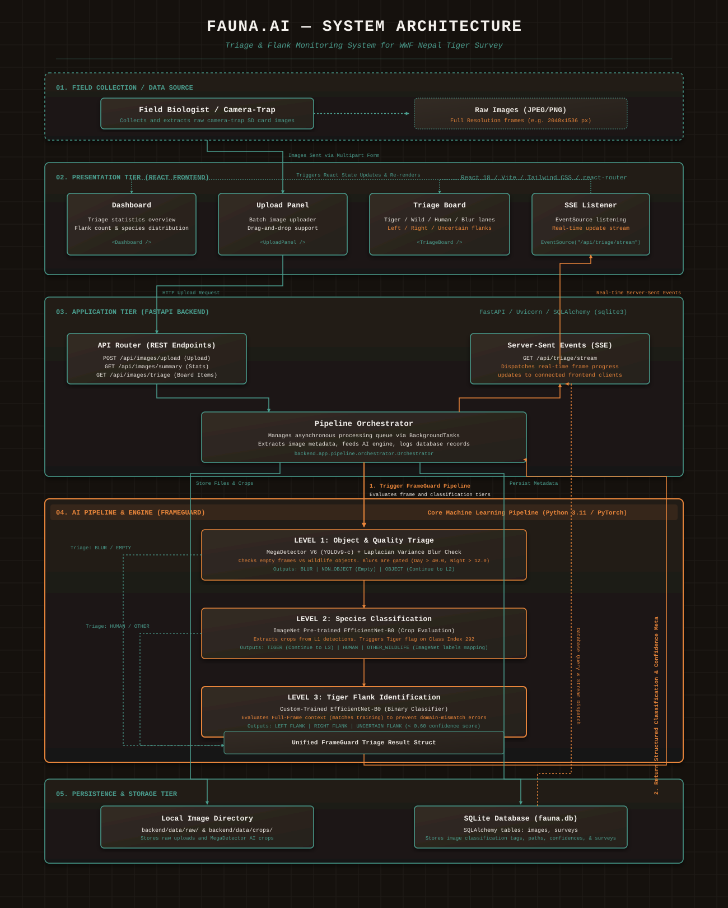
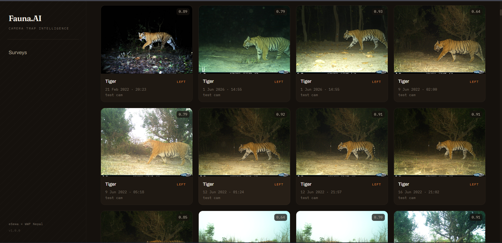
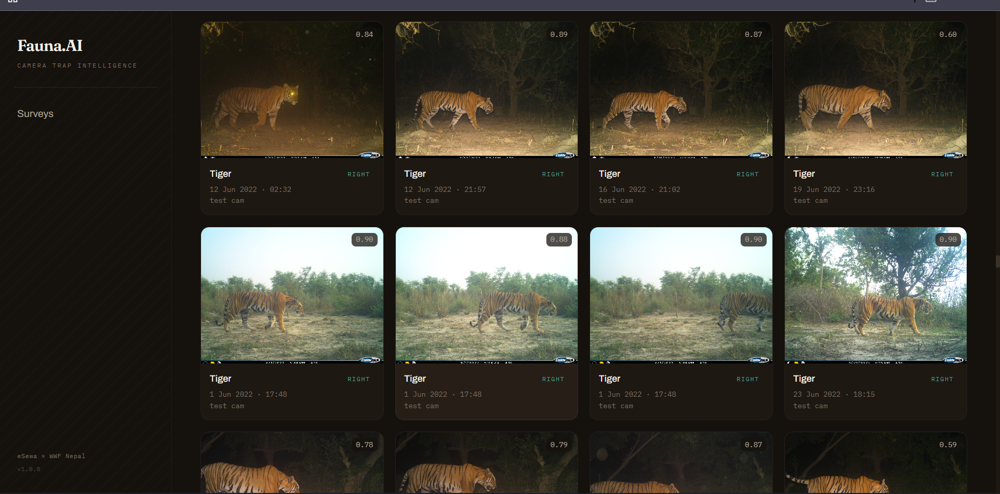
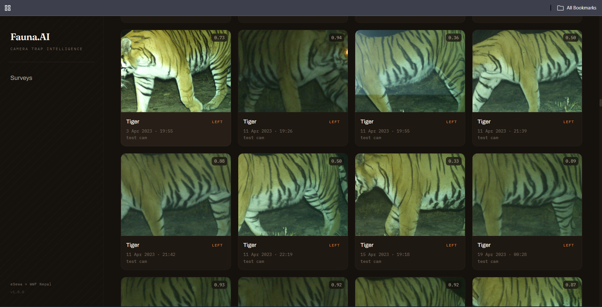
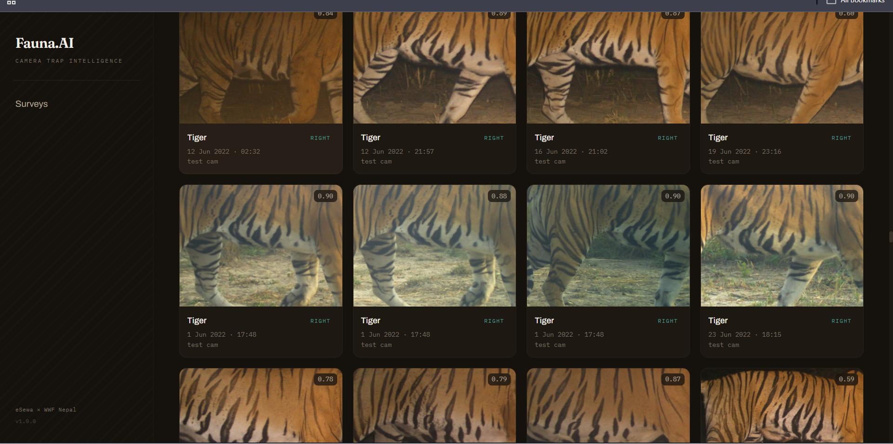
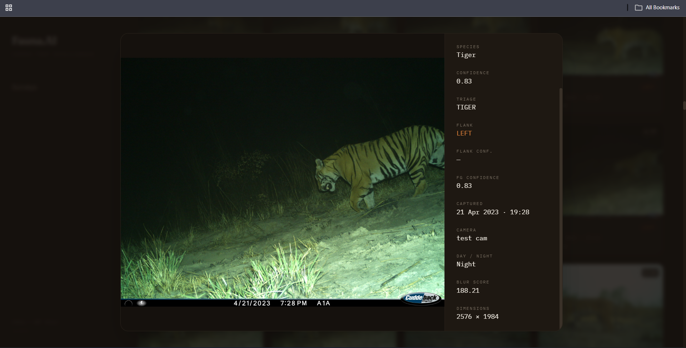

# FaunaAI

Camera-trap image triage for WWF Nepal's tiger survey.

## What it does

Camera traps across Chitwan and Bardia produce thousands of images per survey cycle — most of them empty frames triggered by wind, shadow, or heat. Sorting them by hand burns weeks of ranger time before any real analysis can begin.

FaunaAI's working core is **FrameGuard**: it ingests the raw images, discards the noise (empty, blurry, and overexposed frames), detects animals, identifies tigers, and sorts every tiger by which flank — left or right — is facing the camera. That left/right separation is the groundwork for identifying individual tigers from their stripe patterns, the same way researchers do in mark-recapture studies.

Species identification for non-tiger wildlife and long-term behavioral anomaly detection are part of the broader vision (see [Roadmap](#roadmap-future-vision)) — FrameGuard is what's built and running today.

The goal: cut the gap between raw capture and usable data from weeks down to hours.

## Architecture



Images flow from upload through the FrameGuard pipeline into SQLite, with results streaming to the React dashboard in real time over SSE. The diagram also shows the planned SpeciesID and PulseScan layers (see Roadmap).

## How FrameGuard works

Every uploaded image runs through FrameGuard, coordinated by `PipelineOrchestrator`, and exits with exactly one of five labels: **TIGER**, **OTHER_WILDLIFE**, **HUMAN**, **NON_OBJECT**, or **BLUR**.

The steps run in order:

**1. Overexposure / flare gate.** Before anything else, blown-out frames — a full white-out, or a night flash misfire that leaves a bright flare — are caught and sent straight to **BLUR**. This runs first so a flare can't be mistaken for an animal or a person. A frame with more than 40% blown-out pixels (or more than 5% in a night frame) is treated as unusable.

**2. Detection.** The primary detector is **MegaDetectorV6** (`MDV6-yolov9-c`, via PytorchWildlife), purpose-built for camera-trap imagery — it handles dense canopy, night IR, and cluttered backgrounds far better than a general-purpose object detector. YOLO26n is available as a fallback via `DETECTOR_BACKEND=yolo`. Night frames get **CLAHE** contrast enhancement before detection to recover detail from underexposed IR.

**3. Blur check on the crop.** Blur is evaluated on the detected animal's crop, not the whole frame, with separate day and night thresholds. IR sensors naturally produce lower Laplacian variance, so a single threshold would wrongly flag sharp night tigers as blurry. Only genuinely motion-smeared animals go to **BLUR**.

**4. Tiger vs. other wildlife.** The animal crop goes to an **EfficientNet-B0** (ImageNet weights) classifier. If the top prediction is class 292 (*tiger, Panthera tigris*), the frame is labeled **TIGER**; any other animal becomes **OTHER_WILDLIFE**. A frame with only a person is **HUMAN**. A clear frame with nothing detected is **NON_OBJECT** — and because empty night frames are dark by nature, the empty-frame blur test uses its own night-aware threshold so a dark-but-empty frame isn't mislabeled as blur.

**5. Flank classification.** For tigers, a second **EfficientNet-B0**, fine-tuned on two classes, determines whether the **left** or **right** flank is facing the camera. It runs on the full frame — matching how it was trained — and reliably calls left vs. right on clear broadside shots. Low-confidence calls (below 0.60) are flagged **UNCERTAIN** rather than guessed; an honest "needs review" beats a confidently wrong label in front of field experts.

**6. Flank crops for re-ID.** Each tiger's flank is cropped tight and saved to `backend/data/crops/`. The dashboard's **Flanks** view shows these isolated stripe patterns grouped by left and right — the exact input a future individual-ID model would index on, since every tiger's stripes are unique, like a fingerprint.

Results stream to the dashboard in real time over SSE as each image finishes processing.

## Dashboard

A React dashboard with a dark "field instrument" theme where teams can:

- Create surveys and cameras, then upload or drag-and-drop image batches
- Watch triage results populate live as images process
- Browse results by category — Tiger / Other wildlife / Human / Non-object / Blur — with tigers split into **Left flank**, **Right flank**, and **Uncertain** sections
- Open the **Flanks** view to inspect isolated stripe-pattern crops

## Stack

**Backend** — Python 3.11, FastAPI, SQLAlchemy (async), aiosqlite, PyTorch 2.3, TorchVision, PytorchWildlife (MegaDetector), Ultralytics (YOLO fallback), OpenCV, NumPy, sse-starlette, watchdog

**Frontend** — React 18, React Router 6, Vite 5, Tailwind CSS

**Database** — SQLite via aiosqlite

## Getting started

**Backend**

```bash
cd backend
pip install -r requirements.txt
pip install PytorchWildlife      # needed for MegaDetector
python run.py
```

The API starts at `http://localhost:8000`. On first run it creates `fauna.db` and all required data directories automatically.

> To skip MegaDetector and avoid the weights download, set `DETECTOR_BACKEND=yolo` in a `.env` file inside `backend/`. YOLO26n is used instead.

**Frontend**

```bash
cd frontend
npm install
npm run dev
```

The dashboard runs at `http://localhost:5173`.

**Folder watcher** (optional)

```bash
cd backend
python -m app.watcher <survey_id> <camera_id> <path/to/watch/folder>
```

Drop an image into the watched folder and it runs through FrameGuard immediately, printing results to the console — useful for live field demos without the upload UI.

## Dashboard

The live dashboard surfaces camera-trap intelligence to field teams in real time. Processing progress and pipeline results stream dynamically to the React interface over Server-Sent Events (SSE). Biologists can instantly track species distribution, verify triage classifications, check camera status, and identify individual tigers by analyzing flank patterns.

## Screenshots

**Triage Board — Left Flank Full-Frame View**


**Triage Board — Right Flank Full-Frame View**


**Flank Stripe Crops — Left Flanks**


**Flank Stripe Crops — Right Flanks**


**Image Detail Modal**


## Model weights and data

FrameGuard runs with real inference out of the box:

- **MegaDetectorV6** weights (`MDV6-yolov9-c`) download automatically on first startup and cache in your PyTorch hub directory.
- **`flank_classifier.pt`** — the fine-tuned EfficientNet-B0 flank model — lives in `backend/models/weights/`.

The `data/` directory and all raw/processed images are not committed to the repo. The server creates `backend/data/raw/`, `backend/data/processed/`, `backend/data/crops/`, and `backend/data/review_queue/` on startup.

## Roadmap (future vision)

These pieces are designed and partially scaffolded, not yet live:

- **SpeciesID** — an EfficientNet-B4 fine-tuned on ~16 Nepal species (Greater One-horned Rhinoceros, Snow Leopard, Red Panda, Clouded Leopard, Asian Elephant, Gaur, Sambar Deer, Indian Leopard, Himalayan Black Bear, Sloth Bear, Nilgai, and others) to name the `OTHER_WILDLIFE` frames. Tiger and human are already resolved by FrameGuard upstream. Until the model is trained, non-tiger animals are labeled "Wildlife (unidentified)" — honest over wrong, since a general-purpose classifier mislabels region-specific species.
- **Individual tiger re-ID** — matching the saved left/right flank crops by stripe pattern to identify individual tigers. This is the natural next layer on top of flank separation; the crops are already being captured for it.
- **PulseScan** — statistical anomaly detection across detections over time: 2-hour activity windows, 30-day rolling baselines per camera and species, and five alert types (sudden absence, frequency spike, activity-time shift, group-size collapse, new-species appearance). Pure pandas/SciPy, no model weights. Surfaces alerts to the dashboard.
